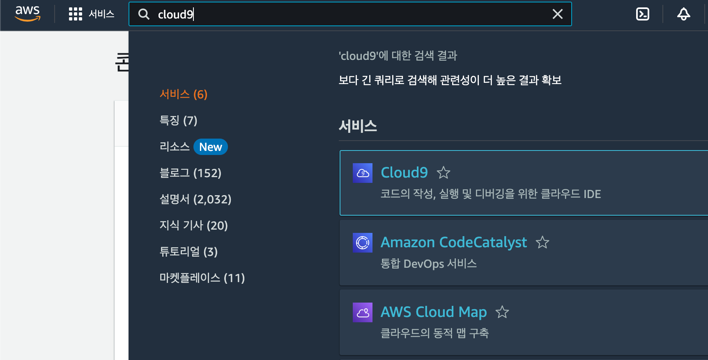
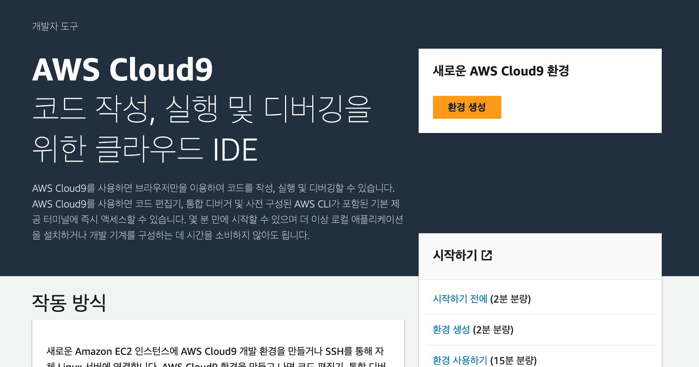
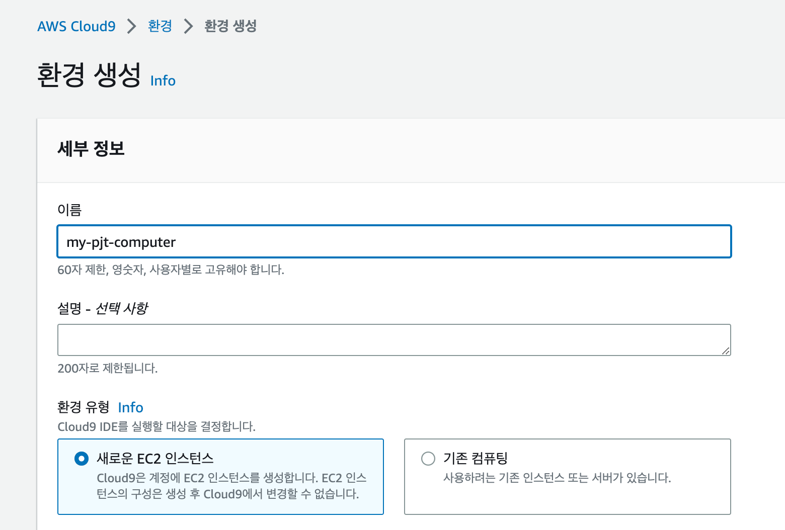
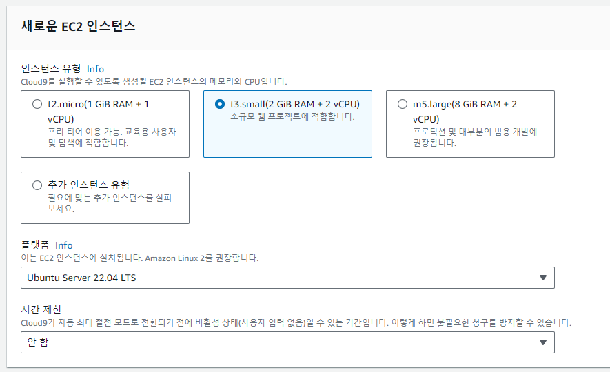
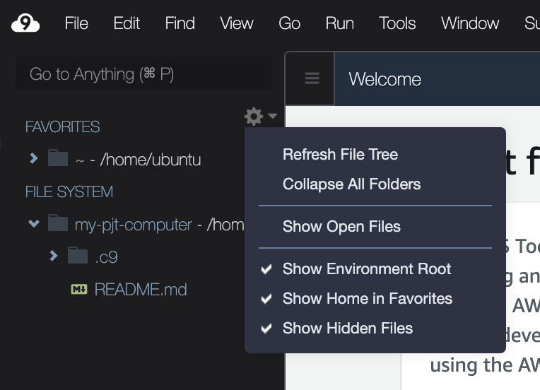
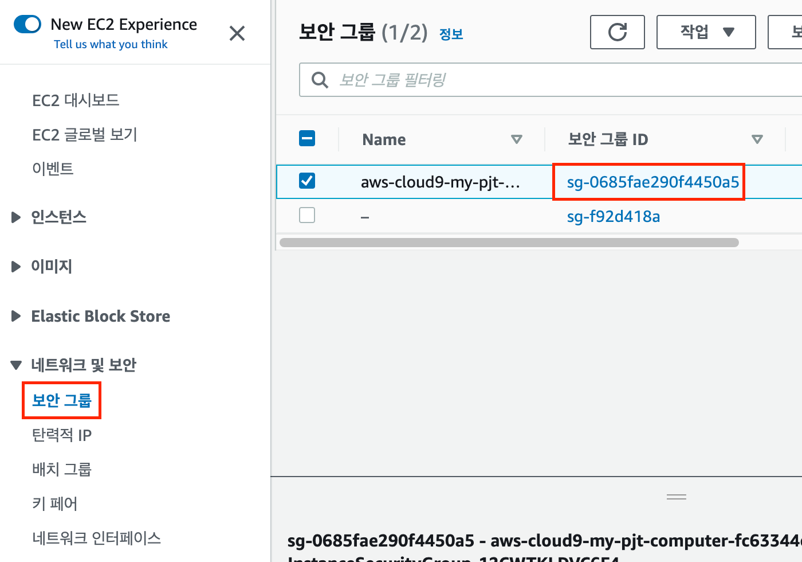
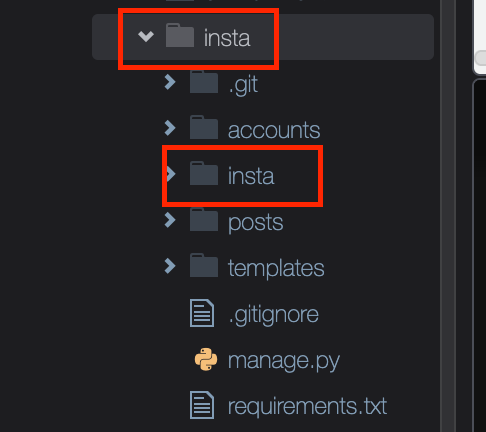
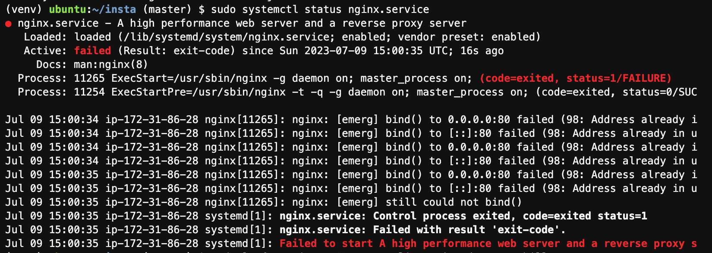

# Django

> Django 서버 배포


## django 추가코드

### 0. settings.py

- ALLOWED_HOSTS
  - EC2 서버주소를 등록
  - 편하게 배포하기 위하여 `*` 로 등록 후 추후 수정가능

```python
# settings.py
ALLOWED_HOSTS = [
    '.amazonaws.com',
    '*',
]
```

### 1. urls.py / views.py

```python
# insta/urls.py
urlpatterns = [
    path('admin/', admin.site.urls),
    path('posts/', include('posts.urls')),
    path('accounts/', include('accounts.urls')),
    path('', views.main, name='main'),
    # => 최상위 url에 접속 했을 때 posts앱의 index로 이동  

] + static(settings.MEDIA_URL, document_root=settings.MEDIA_ROOT)
```

```python
# insta/views.py
from django.shortcuts import redirect


# Create your views here.
def main(request):
    return redirect('posts:index')
  
```


### 2. 의존성 저장

- freeze

```shell
pip freeze > requirements.txt
```


### 3. git push

- 원격저장소에 업로드 (add, commit, push)


## aws

### 0. 준비

- 완성된 django프로젝트
- 해외결제가 가능한 체크카드 or 신용카드
- 여유로운 마음


### 1. https://aws.amazon.com/ko/

- AWS 계정 생성
- 기본정보입력
- 카드정보입력
- 휴대폰인증
- 완료후 로그인


### 2. aws cloud9 

- AWS Management Console 에서 Cloud9 검색




- 환경 생성




- 세부 정보




- 인스턴스

  - 인스턴스 유형 : `t3.small` 로 설정

  - 서버를 끄지 않으려면 `안함` 으로 설정




- 파일트리설정
  - [v] Show Home in Favorites
  - [v] Show Hidden Files





## EC2

> 새로운 탭에서 진행
>
> EC2는 cloud9 생성시 자동생성

### 0. 서비스검색


### 1. 보안그룹

- 생성된 ID 클릭




### 2. 인바운드 설정

- 편집


- 규칙 추가 후 저장


## python

### 0. pyenv 

- 설치 & 설정
  - 전체 복사 후 터미널에서 실행

```shell
git clone https://github.com/pyenv/pyenv.git ~/.pyenv

echo 'export PYENV_ROOT="$HOME/.pyenv"' >> ~/.bashrc
echo 'export PATH="$PYENV_ROOT/bin:$PATH"' >> ~/.bashrc
echo -e 'if command -v pyenv 1>/dev/null 2>&1; then\n  eval "$(pyenv init -)"\nfi' >> ~/.bashrc

source ~/.bashrc
```


### 1. python 설치&전역등록

- python 설치를 위한 라이브러리 설치
  - 한줄씩 실행 / 출력되는 보라색 화면에서 enter 눌러서 진행

```shell
sudo apt-get install liblzma-dev
sudo apt-get install libbz2-dev
```

> 프로젝트 진행한 버전에 맞게 설치

```shell
pyenv install 3.11.4
pyenv global 3.11.4
python -V
#=> Python 3.11.4
```


## project clone

> 루트폴더와 프로젝트, 두개의 폴더 이름에 주의하며 진행해주세요.
> 두 폴더의 이름을 통일하면 조금더 편하게 설정할 수 있습니다.

### 0. 준비

- `~`로 이동 => `cd ~`
  - 명령어를 작성하는 위치 주의!


- clone
  -  private repo의 경우 github auth token 필요


```
git clone {project_remote_url}
```


- 편의를 위해 폴더명 변경
  - 프로젝트 전체 폴더의 이름을 프로젝트이름과 동일하게 변경




- 폴더구조
  - 프로젝트이름은 변수처럼 사용예정 이름 기억!

```
home
	ubuntu
		{프로젝트이름}
			{프로젝트이름}
			{앱}
			manage.py
```


- 클론한 폴더로 이동

```shell
cd {프로젝트이름}
```


- 가상환경 

```shell
python -m venv venv
source venv/bin/activate

```


- 라이브러리 설치

```shell
pip install -r requirements.txt
```

- 마이그레이션

```
python manage.py migrate
```

- createsuperuser

```shell
python manage.py createsuperuser
```


## nginx

### 0. 설치
- 한줄씩 실행 / 출력되는 보라색 화면에서 enter 눌러서 진행

```shell
sudo apt-get update
sudo apt-get install -y nginx
```


### 1. 설정

> vi를 사용하여 터미널에서 파일을 수정합니다.
> 사용법을 숙지하고 진행해주세요.


- 복사할 코드 미리 작성하기
  - 아래의 코드에서 각자의 프로젝트이름에 맞게 수정 후 아래에 붙여넣기
  - staticfiles의 경우 다른 폴더를 썼다면 이름수정

```
server_name *.amazonaws.com;

location / {
		uwsgi_pass unix:///home/ubuntu/{프로젝트이름}/tmp/{프로젝트이름}.sock;
		include uwsgi_params;
}

location /static/ {
	alias /home/ubuntu/{프로젝트이름}/staticfiles/;
}
```
```

server_name *.amazonaws.com;

location / {
		uwsgi_pass unix:///home/ubuntu/insta/tmp/insta.sock;
		include uwsgi_params;
}

location /static/ {
	alias /home/ubuntu/insta/staticfiles/;
}
```

- 결과 붙여넣기 위한 빈칸

```


```


- 파일 수정

```shell
sudo vi /etc/nginx/sites-enabled/default
```


- 아래의 표시된 부분 수정
  - `i` 버튼으로 수정모드로 전환 
  - 아래의 부분으로 방향키를 이용하여 이동
  - 수정
  - `esc` 로 수정모드 빠져나오기
  - `:wq` 명령어로 저장 후 종료


## uWSGI

### 0. 설치

```shell
pip install uwsgi
```


### 1. 폴더&파일 생성

- 프로젝트 폴더 이동 (기존의 위치와 동일)

```
cd ~/{프로젝트이름}
```


- uwsgi 설정, 로그 저장할 폴더 생성 (파일트리에서 생성해도 무방)

```shell
mkdir tmp
mkdir -p log/uwsgi
mkdir -p .config/uwsgi/
```


- uwsgi 설정파일 생성 (파일트리에서 생성해도 무방)

```shell
touch .config/uwsgi/{프로젝트이름}.ini
```
touch .config/uwsgi/insta.ini


### 3. 수정

- `.config/uwsgi/{프로젝트이름}.ini` 설정파일 수정

```
# {프로젝트이름}/.config/uwsgi/{프로젝트이름}.ini

[uwsgi]
chdir = /home/ubuntu/{프로젝트이름}
module = {프로젝트이름}.wsgi:application
home = /home/ubuntu/{프로젝트이름}/venv

uid = ubuntu
gid = ubuntu

socket = /home/ubuntu/{프로젝트이름}/tmp/{프로젝트이름}.sock
chmod-socket = 666
chown-socket = ubuntu:ubuntu

enable-threads = true
master = true
vacuum = true
pidfile = /home/ubuntu/{프로젝트이름}/tmp/{프로젝트이름}.pid
logto = /home/ubuntu/{프로젝트이름}/log/uwsgi/@(exec://date +%%Y-%%m-%%d).log
log-reopen = true
```

- 결과 붙여넣기 위한 빈칸

```


```


### 4. daemon

- 설정파일 생성 (파일트리에서 생성해도 무방)

```shell
touch .config/uwsgi/uwsgi.service
```


- `.config/uwsgi/uwsgi.service` 설정파일 수정

```
[Unit]
Description=uWSGI Service
After=syslog.target

[Service]
User=ubuntu
ExecStart=/home/ubuntu/{프로젝트이름}/venv/bin/uwsgi -i /home/ubuntu/{프로젝트이름}/.config/uwsgi/insta.ini


Restart=always
KillSignal=SIGQUIT
Type=notify
StandardError=syslog
NotifyAccess=all

[Install]
WantedBy=multi-user.target
```

- 결과 붙여넣기 위한 빈칸

```


```


- 심볼릭링크 생성

```shell
sudo ln -s ~/{프로젝트이름}/.config/uwsgi/uwsgi.service /etc/systemd/system/uwsgi.service
```

sudo ln -s ~/insta/.config/uwsgi/uwsgi.service /etc/systemd/system/uwsgi.service

- **폴더 권한설정**
```bash
sudo chmod 777 /home/ubuntu
```


- 등록

```shell
# daemon reload
sudo systemctl daemon-reload

# uswgi daemon enable and restart
sudo systemctl enable uwsgi
sudo systemctl restart uwsgi.service

# check daemon
sudo systemctl | grep nginx
sudo systemctl | grep uwsgi

# nginx restart
sudo systemctl restart nginx
sudo systemctl restart uwsgi
```


- 아래의 에러 상황에서 80번 포트 프로세스 종료




```shell
sudo lsof -t -i tcp:80 -s tcp:listen | sudo xargs kill
```


- 최종확인
  - EC2대시보드에서 DNS혹은 IP확인

